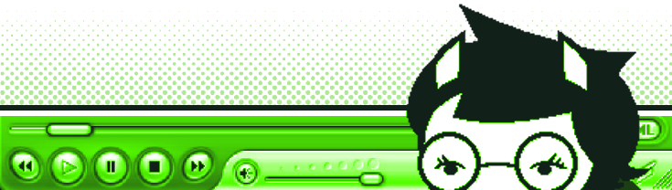
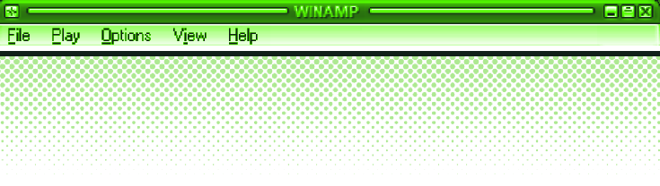

 

<h1>02ANGHEL-O.EXE</h1>

<h3>SOFTWARE DEVELOPMENT STUDENT</h3>

<code>[ SYSTEM ONLINE ]</code>
&nbsp;
<code>[ PLAYER 01 ]</code>
&nbsp;
<code>[ MODE: LEARNING ]</code>

 

<table width="100%">
<tr>

<!-- ==================== MENU ==================== -->

<td width="18%" valign="top">

<h3>☰ MENU</h3>

 

<a href="#about-me">▣ HOME</a>

  

<a href="#about-me">○ ABOUT</a>

  

<a href="#skill-tree">⚙ SKILLS</a>

  

<a href="#current-quest">◈ QUESTS</a>

  

<a href="#project-select">□ PROJECTS</a>

  

<a href="#social-link">↗ SOCIAL</a>

   

━━━━━━━━━━━━

  

<small>

02ANGHEL-O

  

PLAYER 01

  

ONLINE

</small>

</td>

<!-- ==================== CENTER ==================== -->

<td width="57%" valign="top">

<!-- ABOUT -->

<h2 id="about-me">› ABOUT ME</h2>

Hi! I'm <strong>02anghel-o</strong>.

I'm a software development student learning how to turn ideas into code.

I enjoy experimenting with programming, web development and creating random ideas just to see what happens.

I'm also a big fan of the <strong>PS2 / Dreamcast / GameCube era</strong>, old interfaces, retro games, Y2K aesthetics and the weird charm of early internet culture.

<strong>BUILD. BREAK. FIX. REPEAT.</strong>

<!-- PLAYER DATA + CURRENT QUEST -->

<table width="100%">
<tr>

<!-- PLAYER DATA -->

<td width="45%" valign="top">

<h2>› PLAYER DATA</h2>

<table width="100%">

<tr>
<td><strong>NAME</strong></td>
<td>02ANGHEL-O</td>
</tr>

<tr>
<td><strong>CLASS</strong></td>
<td>DEVELOPER</td>
</tr>

<tr>
<td><strong>STATUS</strong></td>
<td>ONLINE</td>
</tr>

<tr>
<td><strong>MODE</strong></td>
<td>LEARNING</td>
</tr>

<tr>
<td><strong>ERA</strong></td>
<td>2000s</td>
</tr>

</table>

</td>

<!-- CURRENT QUEST -->

<td width="55%" valign="top">

<h2 id="current-quest">💿 CURRENT QUEST</h2>

 

<table width="95%">
<tr>
<td align="center">

<strong>CURRENT OBJECTIVE</strong>

  

LEARNING SOFTWARE DEVELOPMENT

  

████████████░░░░░░░░ 60%

  

&gt; Learn
 
&gt; Experiment
 
&gt; Build
 
&gt; Improve

  

<strong>STATUS: IN PROGRESS</strong>

</td>
</tr>
</table>

</td>

</tr>
</table>

<!-- PROJECT SELECT -->

<h2 id="project-select">🕹️ PROJECT SELECT</h2>

<table width="90%">
<tr>
<td align="center">

<h3>🔒 PROJECTS LOCKED</h3>

 

NO PROJECTS YET

  

MORE SOON...

  

<small>NEW PROJECTS WILL APPEAR HERE</small>

</td>
</tr>
</table>

</td>

<!-- ==================== RIGHT ==================== -->

<td width="25%" valign="top">

<!-- SKILL TREE -->

<h2 id="skill-tree">› SKILL TREE</h2>

<strong>HTML</strong>

██████████████████░░
 
90%

<strong>JAVASCRIPT</strong>

███████████████░░░░░
 
75%

<strong>PYTHON</strong>

█████████████░░░░░░░
 
65%

<strong>C#</strong>

██████████░░░░░░░░░░
 
50%

 

 

<!-- SOCIAL LINK DEBAJO DE SKILL TREE -->

<h2 id="social-link">📡 SOCIAL LINK</h2>

  

  

<code>GOOD MUSIC</code>

 

<code>GOOD VIBES</code>

 

<code>BETTER CODE</code>

</td>

</tr>
</table>

 

 

<h3>▶ NOW PLAYING: 02ANGHEL-O.EXE</h3>

<code>○ ○ ○</code>

<strong>[ INSERT COIN ]</strong>

<code>02ANGHEL-O // END OF TRANSMISSION</code>

